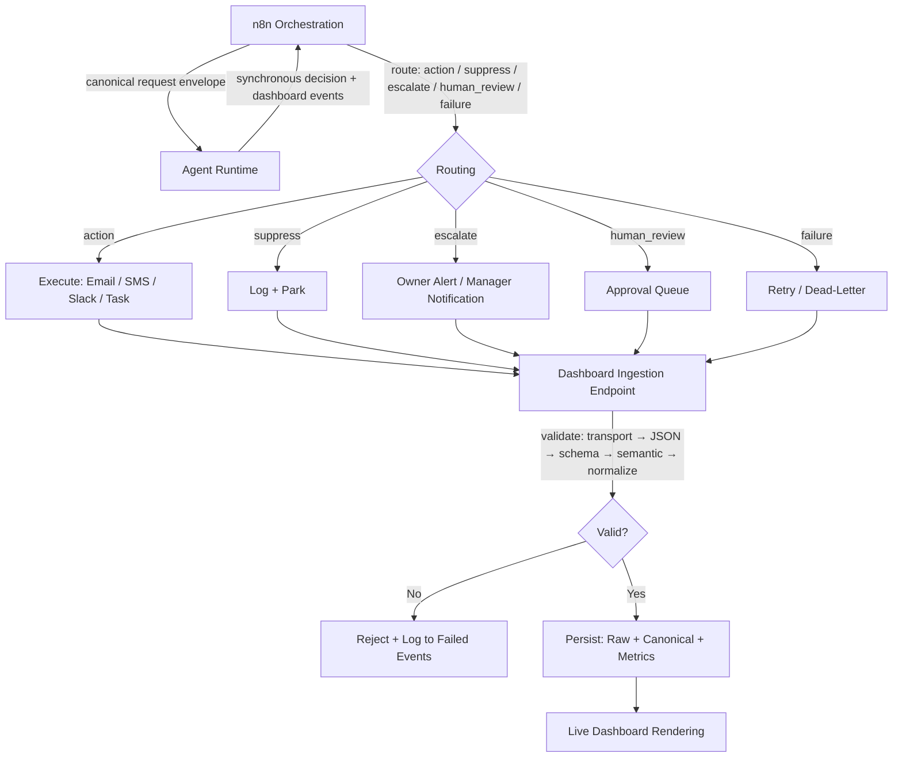

# Enforcement Contracts

**Every enforcement agent in the Revenue Enforcement Framework speaks the same language. This repo defines that language — the universal event schema, the dashboard ingestion contract, and the n8n-to-agent handoff spec. No agent ships without conforming to these contracts. No event reaches the dashboard without passing through them.**

---

## What This Prevents

Enforcement systems fail silently when every agent invents its own event shape, its own error codes, its own definition of "revenue protected." The invoice agent calls it `amount_recovered`. The proposal agent calls it `value_saved`. The renewal agent calls it `arr_retained`. Three agents, three schemas, three dashboards — none of them comparable. Revenue proof becomes a translation exercise instead of a governance layer.

This is how enforcement degrades into tooling. The agents work individually, but the system has no unified observability, no cross-agent metrics, no single source of truth for revenue impact. You can't answer "how much revenue did enforcement protect this month?" because the data doesn't speak the same language.

These contracts eliminate that failure mode. One universal event schema. One ingestion endpoint. One handoff contract between n8n and every agent runtime. Every agent — invoice enforcement, proposal follow-up, renewal enforcement, and every future agent — emits the same canonical event shape, gets validated through the same pipeline, and renders in the same dashboard.

**Without this:** Every agent defines its own schema. Dashboard breaks when you add agent #3. Revenue metrics are incomparable. Proof is fragmented.

**With this:** Every agent emits one canonical event shape. Dashboard ingests uniformly. Revenue metrics aggregate across all agents automatically. One system, one proof layer, infinite agents.

---

## Architecture



**How it works:**

1. **Handoff** — n8n sends a canonical request envelope to any agent runtime. The agent evaluates, decides, and returns a structured response with dashboard-ready events.
2. **Routing** — n8n interprets the response type (success, suppressed, escalated, pending_human, failed) and routes accordingly. No agent invents its own routing categories.
3. **Ingestion** — Every event hits the same dashboard endpoint, passes six-stage validation, and persists as both raw payload and canonical record.

---

## The Three Contracts

### 1. Universal Enforcement Event Schema

**File:** [`contracts/ENFORCEMENT_EVENT_SCHEMA.md`](contracts/ENFORCEMENT_EVENT_SCHEMA.md)
**JSON Schema:** [`contracts/enforcement-event-schema.v1.json`](contracts/enforcement-event-schema.v1.json)

The canonical data shape every agent must emit. Defines required and optional fields across 10 sections: agent identity, execution context, entity being enforced, decision logic, action taken, revenue impact, escalation state, human review state, outcome status, and metadata extension.

Includes conditional validation rules — escalation flags require escalation context, failed outcomes require error codes, sent actions require action types.

This schema is the single source of truth for what an "enforcement event" is. If it doesn't conform to this schema, it doesn't reach the dashboard.

### 2. Dashboard Ingestion Specification

**File:** [`contracts/DASHBOARD_INGESTION_SPEC.md`](contracts/DASHBOARD_INGESTION_SPEC.md)

The production contract for how events enter the live dashboard. Covers:

- Ingestion endpoint design (single + bulk)
- Webhook security with HMAC-SHA256 signing and bearer tokens
- Six-stage validation flow (transport → JSON → schema → semantic → normalization → persistence)
- Idempotency and duplicate event handling
- Retry policy with exponential backoff
- Storage requirements with retention windows (12 months raw, 24 months canonical, 90 days rejected)
- Metrics derivation rules for every dashboard view (revenue, actions, escalations, failures, latency)
- Late, failed, and out-of-order event handling
- Version compatibility rules for future schema updates

### 3. n8n-to-Agent Runtime Handoff Specification

**File:** [`contracts/N8N_AGENT_HANDOFF_SPEC.md`](contracts/N8N_AGENT_HANDOFF_SPEC.md)

The contract between n8n (orchestration) and all agent runtimes (decision-making). Defines:

- Canonical request envelope n8n sends to any agent
- Required headers and HMAC authentication
- Idempotency rules for retries and replays
- Five mandatory response types: `success`, `suppressed`, `escalated`, `pending_human`, `failed`
- How n8n routes each response type into downstream actions
- Timeout expectations (3s target, 10s hard, 15s absolute)
- Retry policy for transient vs permanent failures
- Requirement that every response includes dashboard-ready canonical events
- API versioning rules for forward compatibility

---

## How a New Agent Uses These Contracts

Building a new enforcement agent? Your agent must do three things:

**1. Accept the canonical request envelope from n8n**

Your runtime exposes `POST /api/v1/decide`. n8n sends the standardized request with orchestrator context, trigger details, entity being evaluated, and normalized business inputs. Your agent doesn't define its own request shape — it receives this one.

**2. Return one of five response types with dashboard events**

Your runtime evaluates the enforcement condition and returns `success`, `suppressed`, `escalated`, `pending_human`, or `failed`. No custom response categories. Every response includes at least one canonical event in `dashboard_events` that conforms to the universal event schema.

**3. Emit events that pass dashboard ingestion validation**

Every event your agent produces must pass six-stage validation before it reaches the dashboard. Schema validation, semantic consistency checks, idempotency verification. If it doesn't conform, it gets rejected with a machine-readable error — not silently dropped.

Agent-specific data goes in `metadata`. Revenue metrics go in `revenue`. Decision logic goes in `decision`. The canonical fields power the dashboard. The metadata powers agent-specific views. Nothing crosses that boundary.

---

## Revenue Impact

These contracts don't directly recover revenue. They make revenue proof possible at scale.

Without system contracts, you can run one agent. Maybe two. By agent three, the dashboard is a patchwork of incompatible schemas, the metrics don't aggregate, and you can't answer "how much total revenue did enforcement protect this quarter?" The system fails not because the agents fail, but because the governance fails.

With these contracts:

- **Unlimited agents** feed one dashboard through one ingestion endpoint
- **Revenue metrics aggregate** across invoice enforcement, proposal follow-up, renewal enforcement, and every future agent
- **Cross-agent observability** — see which enforcement patterns produce the highest recovery rates
- **Proof compounds** — every agent you add makes the total revenue story stronger, not more fragmented

**The math for a 3-agent deployment:**

```
Invoice enforcement:       $244K accelerated cash flow annually
Proposal follow-up:        $187K recovered pipeline annually
Renewal enforcement:       $108K prevented churn annually

Without contracts:         3 separate dashboards, 3 incomparable schemas, no aggregate proof
With contracts:            $539K total enforcement impact, one dashboard, one proof layer
```

---

## What's Inside

```
enforcement-contracts/
├── README.md
├── contracts/
│   ├── ENFORCEMENT_EVENT_SCHEMA.md     ← Universal event schema (documentation)
│   ├── enforcement-event-schema.v1.json ← Machine-readable JSON Schema v1
│   ├── DASHBOARD_INGESTION_SPEC.md      ← Dashboard ingestion contract
│   └── N8N_AGENT_HANDOFF_SPEC.md        ← n8n-to-agent runtime handoff contract
└── LICENSE
```

---

## Enforcement Agents Collection

This is part of the **Revenue Enforcement Framework** — open-source autonomous agents that make revenue leakage structurally impossible.

| Agent | Status | What It Enforces |
|-------|--------|-----------------|
| **Enforcement Contracts** (this repo) | ✅ Live | System-wide schema governance for all agents |
| [Enforcement Live Dashboard](https://github.com/ronfarley0317/enforcement-live-dashboard) | ✅ Live | Watch enforcement agents operate in real time |
| [Collections Agent](https://github.com/ronfarley0317/collections-agent) | ✅ Live | No invoice sits unpaid beyond terms |
| Proposal Follow-Up Enforcer | 📋 Planned | No proposal dies in silence |
| Scope Creep Detector | 📋 Planned | No work without compensation agreement |
| Revenue Leakage Counter | 📋 Planned | See how fast your business leaks revenue |

---

## Tech Stack

- **JSON Schema (2020-12)** — Machine-readable validation for the universal event schema
- **HMAC-SHA256** — Webhook signing for ingestion security and runtime authentication
- **n8n** — Orchestration layer that implements the handoff contract
- **Hostinger VPS** — Agent runtime environment
- **Semantic Versioning** — Schema and API version management (`1.x.x` family)

---

## The Law

> *"Any revenue that depends on human memory, discipline, or follow-up will leak at scale."*

These contracts exist because enforcement without governance is just tooling. One agent recovers revenue. A system of agents — all speaking the same language, all feeding the same proof layer — makes revenue leakage structurally impossible across every surface of the business.

The schema is the law's operating system.

---

## License

MIT

---

**Built by [Physis Advisory](https://github.com/ronfarley0317) — Revenue Integrity Engineering**

*We don't help you make more money. We make it impossible to lose money you already earned.*
